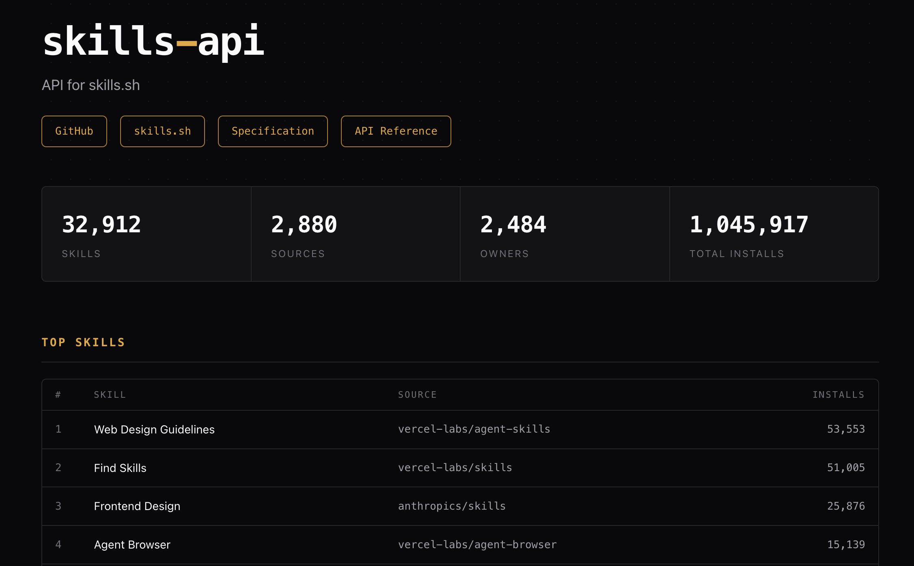

# @mastra/skills-api



API server for [skills.sh](https://skills.sh) -- the open marketplace for Agent Skills.

Serves a browsable registry of 34,000+ skills from 2,800+ repositories. Use it as a standalone server or as a library in your own project.

## Quick Start

```bash
pnpm install
pnpm dev          # http://localhost:3456
```

For production:

```bash
pnpm build && pnpm start
```

## Configuration

| Variable | Default | Description |
|---|---|---|
| `PORT` | `3456` | Server port |
| `HOST` | `0.0.0.0` | Server host |
| `CORS_ORIGIN` | `*` | CORS origin |
| `AUTO_REFRESH` | `false` | Auto-refresh scheduler |
| `REFRESH_INTERVAL` | `30` | Refresh interval (minutes, min 5) |
| `SKILLS_DATA_DIR` | - | Filesystem storage directory |

### S3 Storage

For production, configure S3 (works with AWS, MinIO, Cloudflare R2):

| Variable | Default | Description |
|---|---|---|
| `S3_BUCKET` | - | Bucket name (enables S3) |
| `S3_KEY` | `skills-data.json` | Object key |
| `S3_REGION` | `us-east-1` | AWS region |
| `S3_ENDPOINT` | - | Custom endpoint for S3-compatible services |

```bash
S3_BUCKET=my-bucket AWS_ACCESS_KEY_ID=xxx AWS_SECRET_ACCESS_KEY=xxx pnpm start
```

Storage priority: **S3 > Filesystem > Bundled data**. When both S3 and filesystem are configured, data is saved to both.

## API

The root page (`/`) serves a browsable directory with search and API documentation. All data endpoints are under `/api`.

### Skills

| Endpoint | Description |
|---|---|
| `GET /api/skills` | List and search skills (paginated) |
| `GET /api/skills/top` | Top skills by installs |
| `GET /api/skills/:skillId` | Skill by ID |
| `GET /api/skills/:owner/:repo/:skillId` | Skill by source and ID |
| `GET /api/skills/:owner/:repo/:skillId/files` | Skill file contents from GitHub |
| `GET /api/skills/:owner/:repo/:skillId/content` | Parsed SKILL.md from GitHub |
| `GET /api/skills/by-source/:owner/:repo` | All skills from a repo |

**Search parameters** for `GET /api/skills`:

| Parameter | Default | Description |
|---|---|---|
| `query` | - | Search text |
| `owner` | - | Filter by GitHub owner |
| `repo` | - | Filter by repository |
| `sortBy` | `installs` | `name` or `installs` |
| `sortOrder` | `desc` | `asc` or `desc` |
| `page` | `1` | Page number |
| `pageSize` | `20` | Items per page (max 100) |

### Metadata

| Endpoint | Description |
|---|---|
| `GET /api/skills/sources` | All source repositories with counts |
| `GET /api/skills/sources/top` | Top sources by installs |
| `GET /api/skills/owners` | All owners with counts |
| `GET /api/skills/agents` | Supported AI agents |
| `GET /api/skills/stats` | Registry statistics |

### Admin

| Endpoint | Description |
|---|---|
| `GET /api/admin/status` | Scheduler and data status |
| `POST /api/admin/refresh` | Trigger manual refresh |
| `POST /api/admin/scheduler/start?interval=30` | Start auto-refresh |
| `POST /api/admin/scheduler/stop` | Stop auto-refresh |

## Updating Data

```bash
# Manual scrape
pnpm scrape

# Auto-refresh via env
AUTO_REFRESH=true REFRESH_INTERVAL=30 pnpm start

# Via admin API
curl -X POST http://localhost:3456/api/admin/refresh
```

## Library Usage

```typescript
import { createSkillsApiServer } from '@mastra/skills-api';

const app = createSkillsApiServer({
  cors: true,
  corsOrigin: 'https://your-domain.com',
  prefix: '/api',
});
```

### Direct Data Access

```typescript
import {
  skills,
  metadata,
  getSources,
  getOwners,
  getTopSkills,
  supportedAgents,
} from '@mastra/skills-api';

console.log(`${skills.length} skills, scraped ${metadata.scrapedAt}`);
```

### Scraper

```typescript
import { scrapeAndSave } from '@mastra/skills-api';

await scrapeAndSave();
```

### GitHub Content

```typescript
import { fetchSkillFromGitHub } from '@mastra/skills-api';

const result = await fetchSkillFromGitHub('vercel-labs', 'agent-skills', 'vercel-react-best-practices');
if (result.success) {
  console.log(result.content.instructions);
}
```

## Development

```bash
pnpm dev        # Dev server with watch
pnpm test       # Run tests
pnpm build      # Production build
pnpm scrape     # Update skills data
```

## License

MIT
